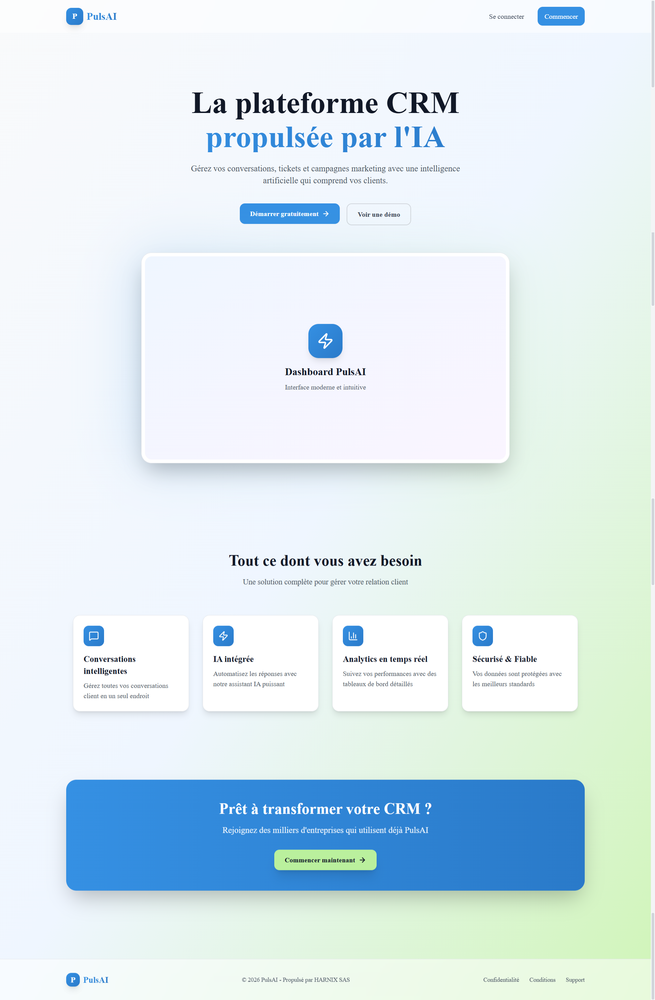
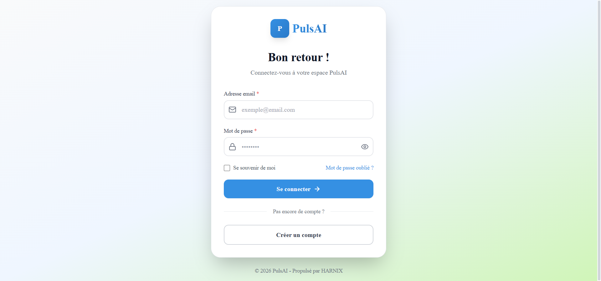
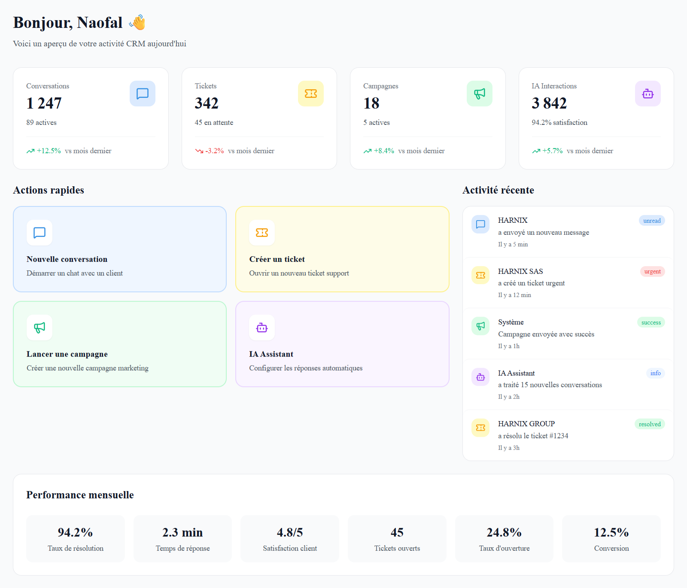
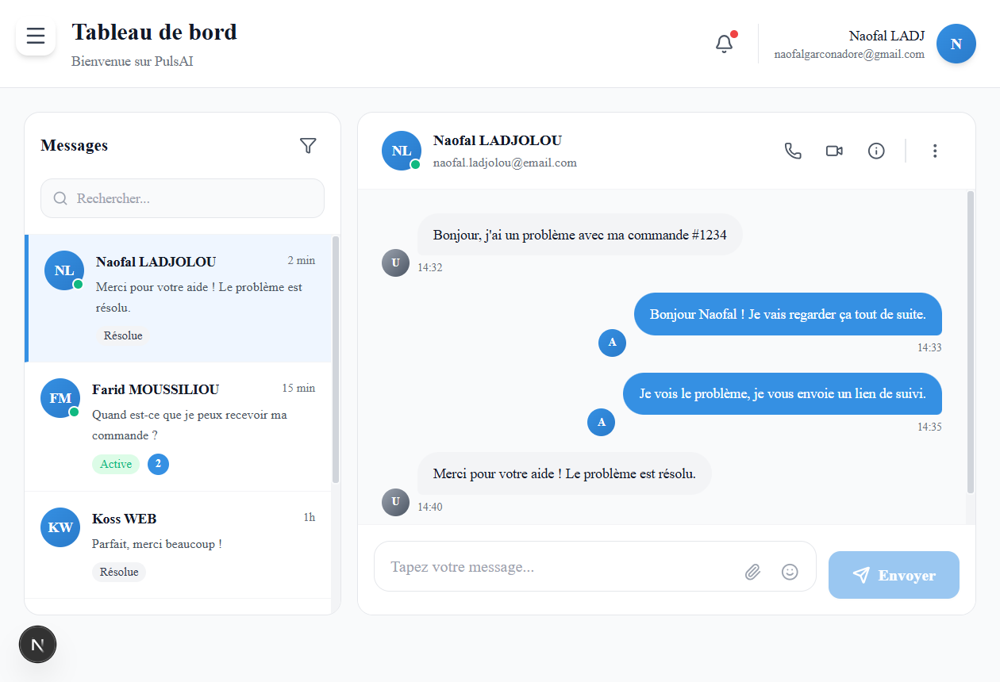
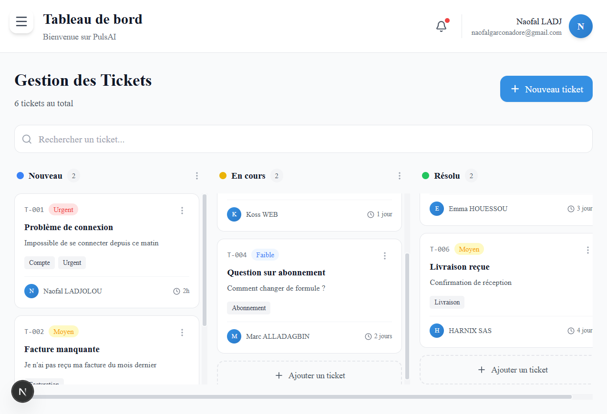
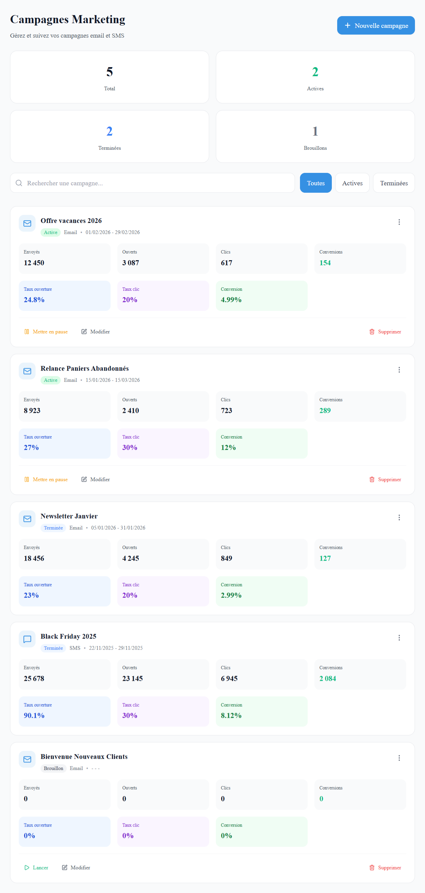
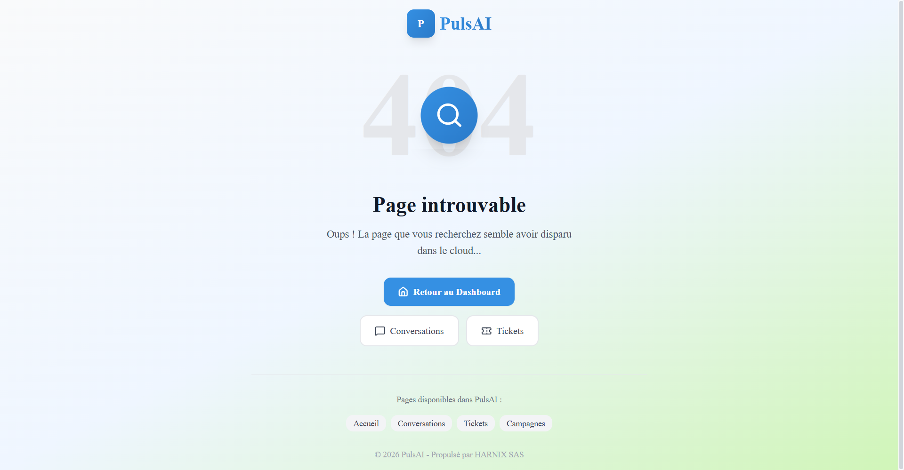
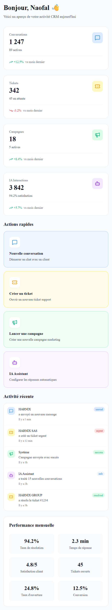

# PulsAI Dashboard - CRM Intelligent

> Dashboard CRM moderne propulsé par l'IA - Test d'intégration HARNIX SAS

## À propos du projet

PulsAI est une plateforme CRM intelligente qui combine IA conversationnelle, gestion de tickets et automatisation marketing. Ce projet a été développé dans le cadre du test d'intégration pour le poste de Développeur Front-End React/ Next.js chez HARNIX SAS.

### Fonctionnalités principales

- **Dashboard** - Vue d'ensemble avec statistiques en temps réel
- **Conversations** - Inbox avec chat en temps réel
- **Tickets** - Kanban board pour la gestion des tickets support
- **Campagnes** - Gestion et suivi des campagnes marketing
- **Authentification** - Système complet avec validation Zod
- **Design System** - Interface moderne inspirée d'Intercom et Crisp.

---

## Technologies utilisées

### Stack principale

- **Framework** : [Next.js 16.1.6](https://nextjs.org/) (App Router)
- **Styling** : [Tailwind CSS 3.4.17](https://tailwindcss.com/)
- **Animations** : [Framer Motion 11.15.0](https://www.framer.com/motion/)
- **Icônes** : [Lucide React 0.468.0](https://lucide.dev/)
- **Validation** : [Zod 3.24.1](https://zod.dev/)
- **Polices** : Ubuntu (via next/font)

### Outils de développement

- **Runtime** : Node.js 18+
- **Package Manager** : npm
- **Version Control** : Git

---

## Installation et démarrage

### Prérequis

- Node.js 18.x ou supérieur
- npm ou yarn

### Étapes d'installation

1. **Cloner le repository**
```bash
git clone https://github.com/Nao61/pulsai-dashboard.git
cd pulsai-dashboard
```

2. **Installer les dépendances**
```bash
npm install
```

3. **Lancer le serveur de développement**
```bash
npm run dev
```

4. **Ouvrir dans le navigateur**
```
http://localhost:3000
```

### Scripts disponibles
```bash
npm run dev      # Serveur de développement
npm run build    # Build de production
npm run start    # Serveur de production
npm run lint     # Linter ESLint
```

---

## Captures d'écran

### Page d'accueil

*Interface d'accueil moderne avec hero section et features*

### Authentification

*Page de connexion avec validation Zod*

### Dashboard

*Vue d'ensemble avec KPIs, actions rapides et activité récente*

### Conversations

*Inbox avec chat en temps réel*

### Tickets

*Kanban board pour la gestion visuelle des tickets*

### Campagnes

*Liste détaillée avec métriques de performance*

### 404 NotFound

*Pages 404 stylisées*

### Vue sur Mobile

*Site adaptés aux différents types d'écrans*

---

## Structure du projet
```
pulsai-dashboard/
├── src/
│   ├── app/                      # Pages Next.js (App Router)
│   │   ├── auth/                 # Pages d'authentification
│   │   │   ├── login/
│   │   │   └── register/
│   │   ├── dashboard/            # Pages du dashboard
│   │   │   ├── campaigns/
│   │   │   ├── conversations/
│   │   │   ├── tickets/
│   │   │   ├── ai/
│   │   │   ├── settings/
│   │   │   └── layout.jsx
│   │   ├── layout.jsx            # Layout racine
│   │   ├── page.jsx              # Page d'accueil
│   │   ├── not-found.jsx         # Page 404
│   │   └── globals.css           # Styles globaux
│   │
│   ├── components/
│   │   ├── ui/                   # Composants UI réutilisables
│   │   │   ├── Button.jsx
│   │   │   ├── Input.jsx
│   │   │   ├── Card.jsx
│   │   │   ├── Badge.jsx
│   │   │   └── Logo.jsx
│   │   ├── layout/               # Composants de layout
│   │   │   ├── Sidebar.jsx
│   │   │   └── Header.jsx
│   │   ├── features/             # Composants métier
│   │   │   ├── StatCard.jsx
│   │   │   ├── ActivityItem.jsx
│   │   │   ├── QuickActionCard.jsx
│   │   │   ├── TicketCard.jsx
│   │   │   ├── ConversationItem.jsx
│   │   │   └── MessageBubble.jsx
│   │   └── ProtectedRoute.jsx
│   │
│   ├── lib/
│   │   ├── utils/
│   │   │   └── auth.js           # Gestion authentification
│   │   └── validations/
│   │       └── auth.js           # Schémas Zod
│   │
│   └── data/
│       └── mockData.js           # Données de test
│
├── public/                       # Assets statiques
├── tailwind.config.js            # Configuration Tailwind
├── postcss.config.mjs            # Configuration PostCSS
├── next.config.js                # Configuration Next.js
└── package.json
```

---

## Design System

### Palette de couleurs
```css
/* Couleurs principales */
--color-primary: #3590E3        
--color-secondary: #BAF09D     

/* Couleurs neutres */
--color-neutral-50: #F9FAFB
--color-neutral-900: #111827

/* Couleurs de statut */
--color-success: #10B981
--color-warning: #F59E0B
--color-error: #EF4444
--color-info: #3B82F6
```

### Typographie

- **Police principale** : Ubuntu (300, 400, 500, 700)
- **Tailles** : De 11px (captions) à 32px (titres)

---

## Authentification

Le système d'authentification utilise :
- **LocalStorage** pour la persistance (simulation)
- **Zod** pour la validation des formulaires
- **Routes protégées** avec redirection automatique

### Test

Pour tester l'application, créez un compte via la page d'inscription 

---

## Déploiement

### Vercel (Recommandé)

1. Push le code sur GitHub
2. Importer le projet sur [Vercel](https://vercel.com)
3. Déployer automatiquement

### Build manuel
```bash
npm run build
npm run start
```

---

## Fonctionnalités implémentées

- Authentification complète (Login/Register/Logout)
- Dashboard avec statistiques en temps réel
- Gestion des conversations (inbox + chat)
- Gestion des tickets (Kanban board)
- Gestion des campagnes marketing
- Navigation responsive 
- Animations fluides avec Framer Motion
- Validation de formulaires avec Zod
- Pages 404 personnalisées
- Design system cohérent
- Optimisation next/font

---

## Fonctionnalités à venir

- [ ] IA Assistant (configuration chatbot)
- [ ] Paramètres utilisateur complets
- [ ] Drag & drop pour le Kanban
- [ ] Envoi réel de messages
- [ ] Notifications push
- [ ] Export de données
- [ ] Mode sombre

---

## Notes de développement

### Choix techniques

- **Tailwind V3** : Choisi pour sa stabilité avec Next.js 15+ et Turbopack
- **LocalStorage** : Utilisé pour simuler l'authentification (backend à implémenter)
- **Données mockées** : Toutes les données sont simulées pour la démo
  

### Responsive

- Mobile (320px - 767px)
- Tablet (768px - 1023px)
- Desktop (1024px+)

---

## Auteur

**Développé par** : Naofal LADJOLOU  
**Dans le cadre de** : Test d'intégration HARNIX SAS  
**Date** : 28/01/2026 - 03/02/2026  
**Contact** : ladjolou.naofal@gmail.com

---

## License

Ce projet a été développé dans le cadre d'un test technique pour HARNIX SAS.

---

## Remerciements

- **HARNIX SAS** pour l'opportunité
- **Intercom** pour l'inspiration design
- **Crisp** pour les bonnes pratiques UX
- **Communauté Next.js** pour la documentation

---

